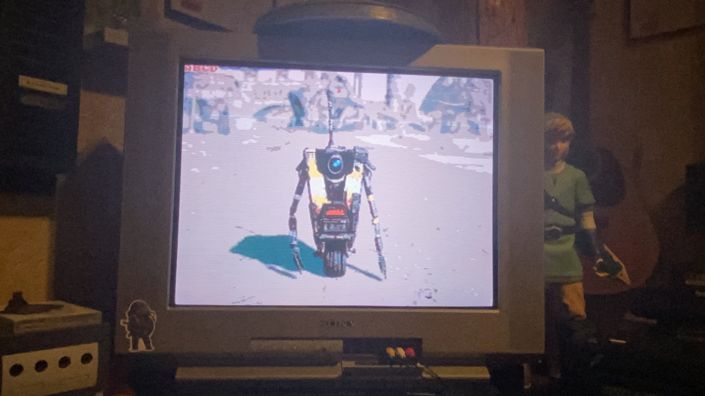
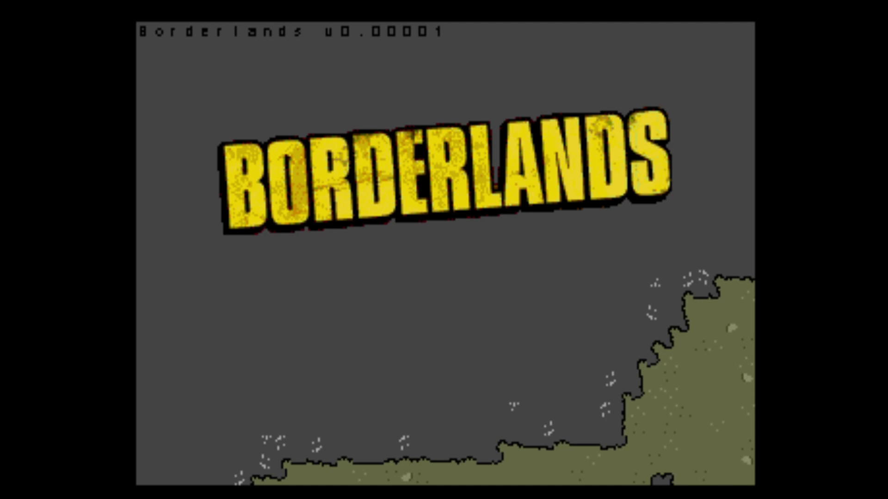

# Fyrestone

## Overview

This project is a sandbox for me to learn Sega Genesis (Motorola 68000) assembly, with the lofty (and probably unrealistic) goal of creating an unofficial 16-bit version of Borderlands.  

It’s unlikely I’ll ever reach that finish line, but setting a fun target helps keep the learning process engaging.

# Media

  
*Tiled image/font test.*

*Video demo.*

### Progress

Not very far! At this point I have a tiled map loaded which can be scrolled around using the controller.  
The “game” does run on actual Genesis hardware, which was a milestone I wanted to reach.  

I don’t often have time to work on this anymore, but I’ve left it here as a reference for the future (and for anyone curious).

### Disclaimer

This is an unofficial, fan-based project and has no affiliation with Gearbox Software or Sega.

## Development Tools

- [SGDK](https://github.com/Stephane-D/SGDK)  
- [Pro Motion NG](https://www.cosmigo.com/)  
- [Tiled](https://www.mapeditor.org/)  
